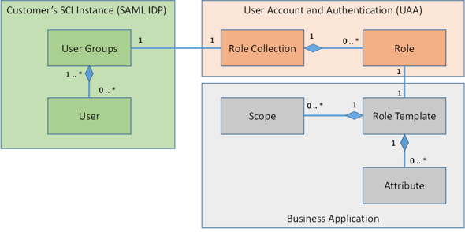
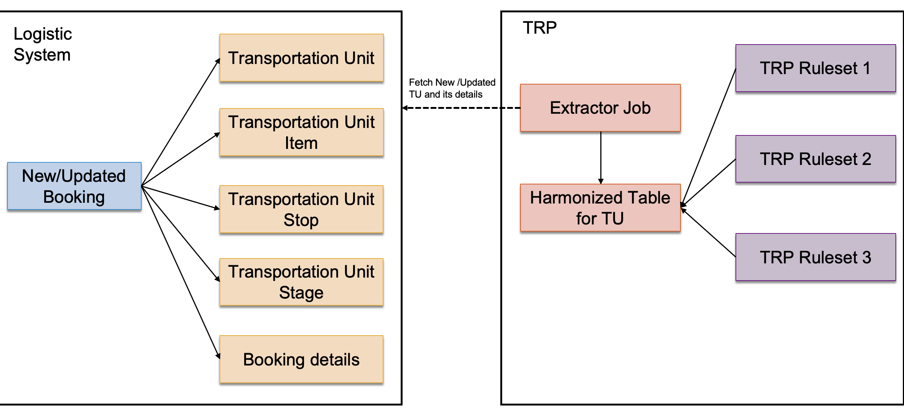
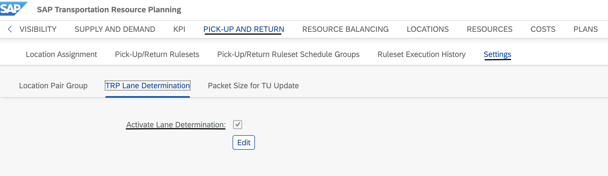
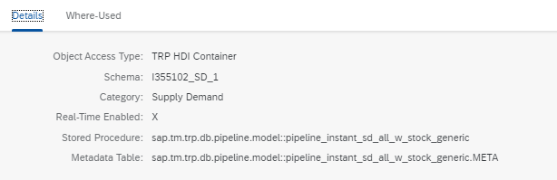
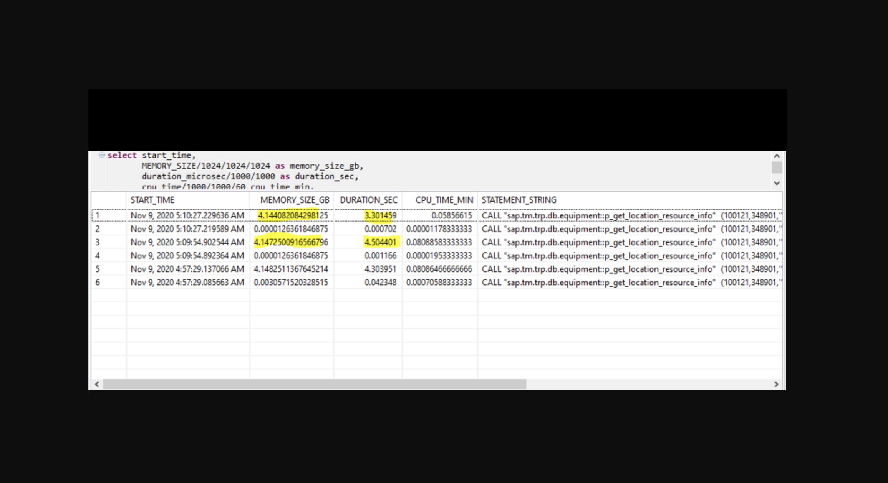
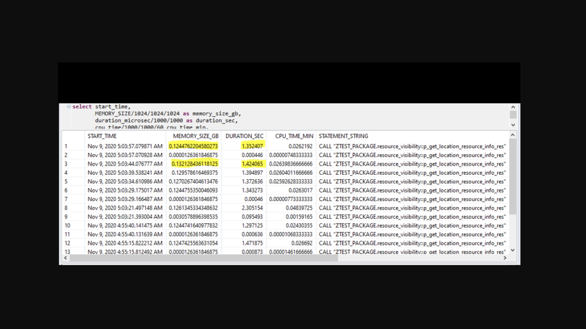

# TRP 4.0 Enablement Sessions

- [TRP 4.0 Enablement Sessions](#trp-40-enablement-sessions)
  - [High Level Architecture Overview - What has changed from 2.0 to 4.0](#high-level-architecture-overview---what-has-changed-from-20-to-40)
  - [How does Side-Car deployment Work](#how-does-side-car-deployment-work)
    - [Introduction](#introduction)
    - [SLT (SAP Landscape Transformation Replication Server)](#slt-sap-landscape-transformation-replication-server)
      - [SLT-Introduction](#slt-introduction)
      - [Configuration](#configuration)
      - [Important Considerations](#important-considerations)
  - [Roles, Scopes & Privileges in TRP](#roles-scopes--privileges-in-trp)
    - [Brief of Roles, Scopes & Privileges in XSA](#brief-of-roles-scopes--privileges-in-xsa)
    - [Useful Sources](#useful-sources)
    - [Other important consideration](#other-important-consideration)
  - [Job Scheduling in TRP4.0](#job-scheduling-in-trp40)
    - [XSA Job scheduler dashboard](#xsa-job-scheduler-dashboard)
    - [What has changed in TRP4.0](#what-has-changed-in-trp40)
      - [1. Job monitor UI](#1-job-monitor-ui)
      - [2. How to check job scheduling logs](#2-how-to-check-job-scheduling-logs)
      - [3. Job APIs as and alternative of XSA job dashboard to get list of inactive schedules or schedules logs](#3-job-apis-as-and-alternative-of-xsa-job-dashboard-to-get-list-of-inactive-schedules-or-schedules-logs)
    - [Important considerations in XSA](#important-considerations-in-xsa)
  - [Data Migration Part 1 : Data Objects](#data-migration-part-1--data-objects)
    - [Microservices list of TRP 4.0](#microservices-list-of-trp-40)
    - [Getting schema name of each application](#getting-schema-name-of-each-application)
    - [Migrating from TRP 2.0 to 4.0](#migrating-from-trp-20-to-40)
  - [Data Migration Part 2 : HRF Rules](#data-migration-part-2--hrf-rules)
    - [Rule Migration Application](#rule-migration-application)
    - [How to Use?](#how-to-use)
  - [Considerations for Custom Objects -> Object Registration](#considerations-for-custom-objects---object-registration)
    - [Object Registration](#object-registration)
    - [Object Access Types in 4.0](#object-access-types-in-40)
    - [Pre-requisites](#pre-requisites)
  - [New workcenters in TRP 4.0](#new-workcenters-in-trp-40)
  - [Introduction to Resource Balancing-Typical scenarios](#introduction-to-resource-balancing-typical-scenarios)
  - [Important TM-TRP touch points](#important-tm-trp-touch-points)
    - [Important TM classes](#important-tm-classes)
    - [Restful APIs](#restful-apis)
    - [EAC](#eac)
    - [Demo](#demo)
  - [Pickup Return-Harmonization of TU Selection](#pickup-return-harmonization-of-tu-selection)
    - [PR Harmonization Introduction](#pr-harmonization-introduction)
    - [PR Harmonization Configuration](#pr-harmonization-configuration)
    - [Clean Up](#clean-up)
  - [Pickup Return-TRP Lane determination](#pickup-return-trp-lane-determination)
    - [Lane Determination Introduction](#lane-determination-introduction)
    - [TRP Lane Determination Configuration](#trp-lane-determination-configuration)
  - [Delivery Model for Bug fixes](#delivery-model-for-bug-fixes)
  - [Instant SD plan - Standard Calculation Models](#instant-sd-plan---standard-calculation-models)
    - [Instand SD Plan Introduction](#instand-sd-plan-introduction)
    - [Instant SD Plan vs Classic SD Plan](#instant-sd-plan-vs-classic-sd-plan)
    - [Custom Model Creation](#custom-model-creation)
    - [Instant Lean Model](#instant-lean-model)
  - [Data Synchronization](#data-synchronization)
    - [Data Sync Introduction](#data-sync-introduction)
    - [How does this happen?](#how-does-this-happen)
    - [When does this happen?](#when-does-this-happen)
    - [How to trace it?](#how-to-trace-it)
    - [Parameters for Data Synchronization](#parameters-for-data-synchronization)
    - [Set Up of Delta Update Scheduled Job](#set-up-of-delta-update-scheduled-job)
  - [Resource Visibility - Performance Improvements](#resource-visibility---performance-improvements)
    - [Existing Problem](#existing-problem)
    - [Performance improvement in Resources tab](#performance-improvement-in-resources-tab)
      - [Pagination](#pagination)
      - [Facet filter](#facet-filter)
    - [Important considerations](#important-considerations-1)
    - [Performance Measurements](#performance-measurements)
      - [**Existing Approach**: No pagination applied in the backend logic](#existing-approach-no-pagination-applied-in-the-backend-logic)
      - [**New approach**: with data limit 1000](#new-approach-with-data-limit-1000)
  - [Q&A](#qa)
    - [Any Questions???](#any-questions)

## High Level Architecture Overview - What has changed from 2.0 to 4.0

---

## How does Side-Car deployment Work

### Introduction

- When `logistic system` and `TRP` are deployed on different servers, it is called side-car deployment.
- Only difference it has from standalone deployment is the `Data Replication` part.
- Logistic system's master data has to be replicated in any of TRP system's classic schema so it could be used by TRP.
- There are many ways to do the data replication. We suggest using SAP Landscape Transformation Replication Server(SLT).

### SLT (SAP Landscape Transformation Replication Server)

#### SLT-Introduction

- Used to `load and replicate` data in real-time or schedule data from the source system and Non-Source System into SAP HANA Database.
- It uses a `trigger-based` replication approach to pass data from source system to target system.
- Components that are used in the technical system landscape
  1. ABAP Source System
  2. Non-ABAP Source System
  3. SAP Landscape Transformation Replication Server
  4. SAP HANA System
- SLT server can be installed on the SAP ABAP System.

#### Configuration

Follow following steps for configuration:

- Install the `SAP LT Replication Server`
- Configure the source data system for RFC access from SAP LT Replication Server
- Start SLT configuration from `LTR/LTRC` transaction
- Start replication from the source system to the target SAP HANA system

> **Note**: For more details check [SLT help portal](https://help.sap.com/viewer/product/SAP_LANDSCAPE_TRANSFORMATION_REPLICATION_SERVER/3.0.04/en-US)

#### Important Considerations

- Master job should be always in running state
- There should be enough dialog processes available for jobs to run

> **Note**: TRP does not give support for any replication tool including SLT.

## Roles, Scopes & Privileges in TRP

### Brief of Roles, Scopes & Privileges in XSA

- `xs-security.json`: A file that defines the details of the authentication methods and authorization types to use for access to your application. The xs-security.json file uses JSON notation to define the security options for an application.

> This file is basically the security blueprint for our application security. The `xs-security.json` file declares the scopes and attributes on which to perform these checks. This enables the User Account and Authentication (UAA) service to limit the size of an application-specific `JSON Web Token (JWT)` by adding only relevant content.

- `Scopes`: Privileges to perform specific actions
- `Attributes`: Application entities a user may access from session context
- `Roles templates`: Combination of list of Scopes and Attributes
- `Role Collection`: Collection of Roles
- These values are maintained in security descriptor (`xs-security.json`) file and evaluated during deployment of mta
- Role Collections are assigned to the user
- An `OAuth2 token` issued by the UAA on a user request contains all scopes and attributes that are granted to the user based
  on his or her assigned role collections
- Based on these scopes and attributes, an application can do an authorization check after having decoded the access token
- `hdbroles/Privileges`: This is HANA db specific access. Just like XSC. So if you want DB restriction between users then you can use this i.e. Admin user can be assigned with hdbrole created for each service modules for db object level access



### Useful Sources

- [Roles, Scopes & Privileges in TRP?](./TRP4.0_Roles%20_V2.xlsx)

- The authorization checks can be performed

  - Declaratively / App Router
  - Programmatically / App Container

- [How to create Administrator user?](https://help.sap.com/viewer/38b8eafc22cf44cfbe2e5eed5631b1b2/4.0/en-US/fa3f145460c741fdaeacb479be27d0a4.html>)

- [how to create region/resource specific roles and application user](https://help.sap.com/viewer/38b8eafc22cf44cfbe2e5eed5631b1b2/4.0/en-US/3d63309bfd87403b905e6346711d1525.html)

- [How to create support user?](https://help.sap.com/viewer/38b8eafc22cf44cfbe2e5eed5631b1b2/4.0/en-US/aa49755e9d324754bb5fd5e81305d3fc.html)

### Other important consideration

- `EFFECTIVE_APPLICATION_PRIVILEGES` table needs to be copied in all modules manually for all users, once user is created and then user has logged in TRP at least once (otherwise without login it wont be created in md schema as well). this needs to be done everytime role collection is changed for that user.
- For `t_user` table for admin, when you create it manually you need to update t_use in all modules for that user. this activity is not needed in case of users created from UI.

---

## Job Scheduling in TRP4.0

### XSA Job scheduler dashboard

- How to create jobs
- How to create schedules
- How to see logs for failed schedules
- Time format of schedule in schedule dashboard is UTC but inside schedule it will be on server time.
- Below XSA roles required to manage job dashboard:
  1. XS_CONTROLLER_ADMIN - Full access: no access restrictions
  2. XS_CONTROLLER_USER - Modify and read-only access
  3. XS_CONTROLLER_AUDITOR - Read-only access

### What has changed in TRP4.0

#### 1. Job monitor UI

- Roles required for accessing this

  `Advance monitoring role`: For administrators to view their own and other users' logs.

  - _TRP_Role_Business_Configuration_Admin_
  - _TRP_Role_Super_Admin_

  `Basic monitoring role`: To view your own logs only.

  - _TRP_Role_Business_Viewer_ or
  - _TRP_Role_Business_Application_User_

  > By default, the following jobs, along with their default status, must be present when application is started

  | Job Name                                | Job Status | Activation Status |
  | --------------------------------------- | ---------- | ----------------- |
  | sap.tm.trp.service.job.jobSchedule.pr   | Available  | Active            |
  | sap.tm.trp.service.job.jobSchedule.sd   | Available  | Active            |
  | sap.tm.trp.service.job.jobSchedule.kpi  | Available  | Active            |
  | sap.tm.trp.service.archive.executor.pr  | Available  | Active            |
  | sap.tm.trp.service.archive.executor.sd  | Available  | Active            |
  | sap.tm.trp.service.archive.executor.kpi | Available  | Active            |

---

- To `create`, `activate`, and `deactivate` jobs, you must be assigned a role containing one of the following role templates
  - _TRP_Business_Configuration_Admin_
  - _TRP_Super_Admin_

#### 2. How to check job scheduling logs

#### 3. Job APIs as and alternative of XSA job dashboard to get list of inactive schedules or schedules logs

### Important considerations in XSA

- Please follow below mentioned criteria while scheduling a job:
  - `Recurrence` : This should be set with minimum value as 15 Minutes.
  - `Start Time`: This should be set with minimum value as (Current time + Recurrence)

---

## Data Migration Part 1 : Data Objects

### Microservices list of TRP 4.0

`TRP 4.0` is microservices based, it has following microservices(applications):

- Master Data Management
- Plan Config
- Pickup and Return
- Resource Visibility
- Resource Balancing
- KPI
- Supply and Demand
- Data Operations
- Monitoring

### Getting schema name of each application

You can get schema name of each application from the MTA extension file that used in TRP 4.0 installation.
Please refer the 15th step of [_Install SAP Transportation Resource Planning_](https://help.sap.com/viewer/38b8eafc22cf44cfbe2e5eed5631b1b2/4.0/en-US/497f021dbeb94415b255e8dbd3273e0b.html) in Master Guide.

### Migrating from TRP 2.0 to 4.0

To migrate data from TRP 2.0 to TRP 4.0,please refer the second step of TRP master guide - section [_Migrating from SAP Transportation Resource Planning 2.0_](https://help.sap.com/viewer/38b8eafc22cf44cfbe2e5eed5631b1b2/4.0/en-US/41a68a6cd3bf4ca7bf148ec1499fd2e3.html).

1. Step 1: Logon to SAP HANA Studio with the admin user you created during installation.(See [_Creating an Administrator User for SAP Transportation Resource Planning_](https://help.sap.com/viewer/38b8eafc22cf44cfbe2e5eed5631b1b2/4.0/en-US/fa3f145460c741fdaeacb479be27d0a4.html)).
2. Step 2: Provide select access on the schemas SAP_TM94, SAP_TM_TRP, and SAP_TM_ROUTING to this user.
3. Step 3: Run the scripts provided in the attachment `Data Migration Guide.docx` in SAP Note [3009534](https://launchpad.support.sap.com/#/notes/3009534).
4. Step 4: Follow the instruction provided in the attachment Check Data Migration Consistency.docx in the same SAP Note([3009534](https://launchpad.support.sap.com/#/notes/3009534)) to do consistency check after the migration is done.

---

## Data Migration Part 2 : HRF Rules

SAP TRP 2.0 uses **SAP HANA Rules Framework (HRF)** for modelling business rules. **HRF** is based on **HANA XS** runtime, and it's not recommended for productive use in SAP HANA 2.0 and above.

SAP TRP 4.0 uses **SAP Cloud Platform Business Rules** for modelling business rules.

### Rule Migration Application

A XSA based application for migrating rules from `SAP HRF` to `SAP CP BRF`, which is ready for performing following tasks:

- Read SAP HRF rules
- Convert rules content to be CP BR aware
- Create CP BR rules

### How to Use?

Refer to SAP Note [_3007851 - SAP Transportation Resource Planning - SAP HRF to SAP Cloud Platform Business Rules - Migration Tool_](https://launchpad.support.sap.com/#/notes/3007851), and,

- Go to application [Github repository](https://github.com/SAP-TRP/SAP-HRF-to-SAP-CP-BR-Migration-Tool), follow the project introduction to build and deploy application.
- Follow the step-by-step usage from SAP Note attachment.

Sample live demo system: <https://gcl0139.wdf.sap.corp:51353/webapp/index.html>

## Considerations for Custom Objects -> Object Registration

### Object Registration

- `Object Registration` provides flexibility to add custom logic to extend the existing TRP logic.

### Object Access Types in 4.0

- `Classical Schema` : If the objects are provided in the user-defined schema

- `Custom HDI Container` : If the objects are provided in the user-defined HDI container

- `TRP HDI Container` : If the objects are pre-defined in the SAP Transportation Resource Planning application.

### Pre-requisites

- In order to migrate the custom objects from 2.0 to 4.0, the following points have to be noted:

- Provide execute privilege on the schema to `_SYS_REPO` using the script mentioned in master guide, refer to the fourth step in the this [link](https://help.sap.com/viewer/38b8eafc22cf44cfbe2e5eed5631b1b2/4.0/en-US/41a68a6cd3bf4ca7bf148ec1499fd2e3.html).

- The schema name of the calculation model has to be modified from `SAP_TM_TRP` to Schema name of SD microservice if it is a SD Calculation model and similarly modified to KPI service name if it is KPI calculation model.

---

## New workcenters in TRP 4.0

---

## Introduction to Resource Balancing-Typical scenarios

---

## Important TM-TRP touch points

### Important TM classes

- _`/TRP/CL_AVAIL_CHECK_SERVICE`_
  - For EAC in TRP 2.0
- _`/TRP/CL_AVAIL_CHECK_SRV_OAUTH`_
  - For EAC in TRP 4.0
- _`/TRP/CL_CHG_LOC`_
  - P&R Update Depot
- _`/TRP/CL_REPO_CREATION`_
  - For Empty Repositioning Booking creation in TRP 2.0
- _`/TRP/CL_REPO_SUBMITTING`_
  - For Empty Repositioning Booking creation in TRP 4.0
- _`/TRP/CL_TRP_ADAPTER`_
  - Class responsible for exactly logic for Empty Repositioning Booking creation.
- _`/TRP/CL_REST_APP`_
  - Restful services registry
- _`/TRP/ACTIVITIES_VALIDATION`_
  - BAdi: validation for which TU can be updated from TRP RB
- _`/TRP/EX_BADI_REPOSITION`_
  - BAdi: determination additional attributes for empty repositioning booking.

### Restful APIs

- All the TM provided restful API are list in class _`/TRP/CL_REST_APP`_

### EAC

- Equipment Availability Check which consume the service API which provided by TRP.
  - `/TRP/CL_AVAIL_CHECK_SERVICE` For EAC in TRP 2.0
  - `/TRP/CL_AVAIL_CHECK_SRV_OAUTH` For EAC in TRP 4.0
  - SM59 External connect from TM to TRP.

### Demo

- Resource Balancing

---

## Pickup Return-Harmonization of TU Selection

### PR Harmonization Introduction

- Introduced as part of performance improvement.

- We now have an extractor job to fetch the updated TU details from TM system at regular intervals.

  

### PR Harmonization Configuration

- Perform Initial load for the harmonization table by executing the procedure `sap.tm.trp.db.pickupreturn.harmonization::p_pr_extr_controller_initial_wrapper`

- Once intial load is done, we can check if the TUs are loaded in the following table to confirm.

- `SELECT * from "sap.tm.trp.db.pickupreturn harmonization::t_pr_harmonized_tu_list"`

- Create a new job for PR exctraction and schedule accordingly.

- Detailed steps to configure the job have been explained in [TRP-4.0 Master Guide](https://help.sap.com/viewer/38b8eafc22cf44cfbe2e5eed5631b1b2/4.0/en-US/09219a70f2bb474da00334780b2f59ce.html).

### Clean Up

- Clean up script available to remove old data that exceeds the provided retention period of the harmonized table when it gets overloaded.

- The script can be run manually or can be scheduled as a recurring job.

---

## Pickup Return-TRP Lane determination

### Lane Determination Introduction

- In the standard process for getting lanes, a call is made to the logistics system to fetch the lane information everytime we need to perform automatic optimization.
- For getting lanes from TM everytime we do run-automatic optimization which is a costly process.
- Introduced a leaner version for checking lanes in TRP.

### TRP Lane Determination Configuration

- Go to Pick-Up and Return Settings.
- On the TRP Lane Determination tab, choose Edit and then select the Activate TRP Lane Determination checkbox.
- Save your entries. 
- If Activate Lane determination checkbox is selected, then we follow TRP logic for Lane Determination, else we follow the standard Lane Determination process from logistics system.

> **Note**: TRP Lane determination will not consider any BADI implementation that could have been implemented for lane determination in the logistics system.

---

## Delivery Model for Bug fixes

---

## Instant SD plan - Standard Calculation Models

### Instand SD Plan Introduction

- Marking real-time enabled flag checked of calculation model in supply demand plan is generally referred as Instant Supply Demand Plan.
  
- Instant SD plans data do not get stored when Execution run is selected as “Instant Result”.
  
- We have two models (Stored Procedures) available for real-time enabled Instant Plans.

### Instant SD Plan vs Classic SD Plan

- Instant SD Plan data source is based on `harmonized tables` where data is stored to custom table via `extractor job` whereas classic SD Plan are based on `TM tables`. Data from Instant/Classic SD Plan is same when configured for same location, resource, time period.

- Extractor Job (_`sap.tm.trp.db.supplydemand.instant.model::pipline_data_extraction_model`_) must be active before executing Instant SD Plan and validate data is stored in custom table _`"sap.tm.trp.db.supplydemand.instant::t_basic_node"`_.
- During Plan creation if `Disable Intermediate Node` is checked, then intermediate node data will not be stored when executed explicitly(Execute Button). However, choosing Instant Result under Execution Run will not be impacted and will show complete node data.

### Custom Model Creation

- _`sap/tm/trp/pipeline/instant_pipeline.hdbflowgraphtemplate`_ template is provided to create custom models.
- Refer SAP Provided Instant model _`“pipeline_instant_sd_all_w_stock_generic”`_ and maintain annotation properties accordingly for each node.

### Instant Lean Model

- `Instant Lean Model` is created considering performance aspects from EAC. Thus, recommended to utilize only for `EAC purposes`.
- Instant Model provides data for all nodes whereas instant lean model provides data only for `SUPPLY_DEMAND` node. Thus, intermediate nodes break up data could not be seen.
- Refer SAP Provided lean model _`“pipeline_instant_lean_sd_all_w_stock_generic”`_ and maintain annotation properties accordingly for each node.

---

## Data Synchronization

### Data Sync Introduction

`SAP Transportation Resource Planning 4.0` is based on a microservice architecture, and two different services need to use data synchronization for communication of data.

The control center for the synchronization service is `trp-sr-srv`. It is installed within the SAP Transportation Resource Planning product package. This section provides some parameters for size thresholds. It also provides details on how you can set up a delta update job in case of any data synchronization failures.

### How does this happen?

When you create a record like **Location Filter**, and this data required by other services, such as **Plan Config**. We need trigger a data synchronization automatically, data will duplicated from source service to target service.

### When does this happen?

- This can happen when you manually create a record or use mass upload.
- If a data synchronization task failed, it will retry 3 times.
- And you can also setup a job to do a delta update in case any data sync failed.

### How to trace it?

you can trace data synchronization status in `TRP UI` > `MONITORING` > `Application Logs`, and filter Business Application as `trp-sr-srv`, then you will get all logs here for data synchronization.

### Parameters for Data Synchronization

The following parameters are relevant for data synchronization:

- _`DATA_SYNC_WRITE_THRESHOLD`_: This parameter specifies the maximum number of records when sending data to receivers within one package. When the data exceeds this threshold, it is split into separate packages.

- _`DATA_SYNC_MAX_THRESHOLD`_: This parameter specifies the maximum number of records for all actions. When this threshold is exceeded, it directly causes an error. Too large a size can destabilize the system. If you do not want to use this threshold for restrictions, then set it to 0.

### Set Up of Delta Update Scheduled Job

To set up the scheduled job for delta updates, you can call the job scheduler RESTful service with `hourly` and `daily` periodicity. You can trace the job in the application log.

You set up the scheduled job using the following details:

- URL: _https://\<host>:\<port>/scheduler/jobs_
- Authorization: Basic authorization (you can find the relevant credentials in the cockpit for the job scheduler)
- Method: POST

> Example:

```json
{
	"name": "sap.tm.trp.service.datasync.reload",
	"description": "Reload recent data sync",
	"action": "https:// <host>:<trp-sr-srv’s port>/reload",
	"active": true,
	"user": "SAP_TRP_TECH_SRV",
	"httpMethod": "POST",
	"schedules": [
		{
			"description": "daily",
			"data": "{\"top\":1,\"skip\":0,\"interval\":86400}",
			"type": "recurring",
			"active": true,
			"repeatInterval": "1 day"
		},
		{
			"description": "hourly",
			"data": "{\"top\":1,\"skip\":0,\"interval\":3600}",
			"type": "recurring",
			"active": true,
			"repeatInterval": "60 minutes"
		}
	]
}
```

---

## Resource Visibility - Performance Improvements

### Existing Problem

- There are `3 parallel calls` triggered from UI :
  1. Fetching Resource information
  2. To get the count of resources
  3. To fetch facet-filter values.
- All 3 parallel calls executing on the same backend logic.
- `Pagination` and `facet-filters` are applied in the service layer

### Performance improvement in Resources tab

#### Pagination

- Captured _`$top`_ & _`$skip`_ value passed from UI in the custom handler function created.
- Identified one point where we can apply all the required filters in the backend logic and applied skip & top in the result set to avoid data loss.

#### Facet filter

- Captured facet-filter values from _`$filter`_ and pushed down to the backend logic.
- This is done for Resource information, resource count & facet-filter fetch logic.

### Important considerations

- Pagination approach not applicable for the below scenarios

  1. When the column filter is applied from the report.
  2. When there is a change in the column order applied.
  3. When the multi-attribute filter is applied.

### Performance Measurements

#### **Existing Approach**: No pagination applied in the backend logic

```sql
CALL "sap.tm.trp.db.equipment::p_get_location_resource_info"
  (100121,348901,'','','CN',?);
```



#### **New approach**: with data limit 1000

```sql
CALL "ZTEST_PACKAGE.resource_visibility::p_get_location_resource_info_res"
  (100121,348901,-1,'','','CN','','','','',1000,0,'','','','','','','-1',?);
```



---

## Q&A

### Any Questions???
